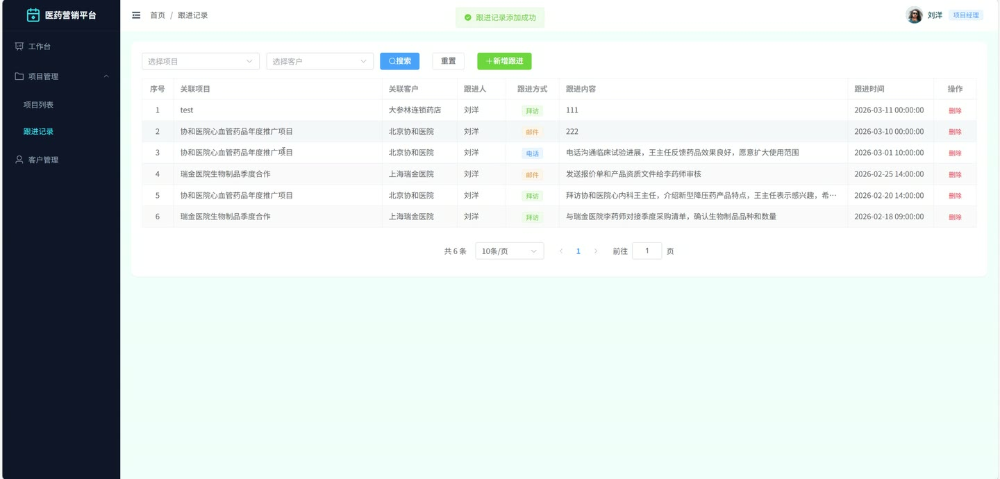

# (附文档)Springboot3+Vue3+MySQL 轻量医药营销项目信息管理平台

**技术栈**：Springboot3、Vue3、MySQL

### 系统简介

本系统是一套面向医药营销场景的轻量级项目信息管理平台，采用前后端分离架构（Spring Boot 3 + Vue 3），支持项目经理、项目主管、管理员三种角色协同工作。系统围绕客户管理、项目管理、任务分配、跟进记录、交付物管理、工时统计等核心业务环节，提供完整的项目全生命周期管理能力，帮助团队高效跟踪项目进度与个人业绩。
 
### 核心功能
 
### 普通用户端

 
- 登录与注册：支持项目经理通过用户名密码登录系统，新用户可自助注册账号。 
- 项目主管入驻申请：用户可提交项目主管角色申请，填写个人资料后等待管理员审核。 
- 查看个人资料与修改：在个人中心查看当前用户信息，支持修改真实姓名、手机号、邮箱等字段。 
- 修改密码：输入旧密码与新密码完成密码修改，确保账号安全。 
- 查看我的客户列表：以分页形式查看自己负责的客户，支持按客户类型、优先级、关键词搜索。 
- 创建客户：填写公司名称、联系人、联系电话、客户类型、优先级等信息，新增客户记录。 
- 编辑与删除客户：对已创建的客户信息进行修改或删除操作。 
- 更新客户优先级：直接调整客户优先级（高/中/低），便于区分跟进重点。 
- 查看我的项目列表：分页展示自己管理的项目，支持按项目名称、状态、品类筛选。 
- 创建项目：填写项目名称、所属品类、客户、合同金额、预计开始/结束日期，新建项目并自动设为“未启动”状态。 
- 编辑与删除项目：对已创建的项目信息进行修改或删除。 
- 结算项目：将已完成的项目标记为“已结算”，记录最终业绩。 
- 查看个人业绩看板：展示项目总数、已签约金额、各状态项目数、进行中/已完成项目数、任务状态统计、逾期任务数、各项目进度列表及月度工时趋势。 
- 查看项目详情：进入项目详情页，查看项目基本信息、关联客户、负责人等。 
- 项目任务管理：在项目下创建任务，填写任务名称、负责人、截止日期、权重；支持编辑、删除任务。 
- 更新任务完成比例：实时调整任务完成百分比，系统自动根据权重计算项目整体进度。 
- 查看任务列表与逾期任务：按项目查看所有任务，并高亮显示已逾期的任务。 
- 记录工时：在任务下填写工时（小时数）并关联项目，支持分页查询和删除。 
- 创建跟进记录：针对客户或项目填写跟进内容、跟进方式、下次跟进时间，记录每次沟通。 
- 查看我的跟进记录：按项目或客户筛选自己的跟进历史，按时间倒序排列。 
- 上传项目交付物：选择项目、文件类型、上传文件（支持图片/文档等），系统自动保存文件路径。 
- 查看项目交付物列表：按项目查看所有已上传的交付物文件，支持按文件类型筛选。 
- 删除交付物：对已上传的交付物进行删除操作。
 
### 管理员端

 
- 分页查询所有用户：按关键词、角色（项目经理/项目主管/管理员）搜索用户列表。 
- 修改用户状态：启用或禁用用户账号，禁用后用户无法登录系统。 
- 删除用户：从系统中移除指定用户。 
- 审核项目主管入驻：查看待审核的项目主管申请列表，通过或驳回申请。 
- 管理产品品类：新增、编辑、删除产品品类（如药品、医疗器械等），支持排序和启用/停用。 
- 管理客户类型：新增、编辑、删除客户类型（如医院、药店、经销商等），支持排序和启用/停用。 
- 查看全局数据看板：展示全平台项目总数、各状态项目数、总业绩金额、客户跟进总数、进行中项目平均进度、月度业绩趋势、各项目进度对比、团队任务状态统计、逾期任务数、成员工作量排名、月度跟进趋势。 
- 查看操作日志：按模块、状态、关键词分页查询所有用户的操作记录，支持清空日志。 
- 文件上传：支持上传任意类型文件，返回文件访问路径。
 
### 项目主管端

 
- 查看主管看板：展示所管辖团队的项目总数、各状态项目数、总业绩金额、客户跟进总数、进行中项目平均进度、月度业绩趋势、各项目进度对比、团队任务状态统计、逾期任务数、成员工作量排名、月度跟进趋势。 
- 查看未及时跟进的项目：系统自动筛选出长时间未更新的项目列表，便于主管督促跟进。 
- 查看团队成员：获取所有项目经理列表（用于分配任务或查看成员信息）。 
- 查看项目列表：按项目名称、状态、品类、负责人等条件搜索查看所有管辖项目。 
- 查看项目详情与任务：进入项目查看基本信息、任务列表、交付物、跟进记录等。 
- 查看跟进记录：按项目或客户查看所有跟进历史。
 
### 技术栈

  后端框架 Spring Boot 3.x   ORM MyBatis-Plus   权限/认证 JWT Token + 自定义 @Log 注解   前端框架 Vue 3 (Vite)   状态管理 Pinia   构建工具 Vite   数据库 MySQL 8.x   文件上传 MultipartFile + 本地存储 
 
### 交付内容

 
- 后端完整源码 
- 前端完整源码 
- 数据库初始化脚本 
- 万字文档

## 界面展示

---

## 获取完整源码 + 万字文档

本仓库为项目介绍页。**完整前后端源码、数据库初始化脚本、万字项目文档**，请加微信 `kangkangcode`，或访问 [codekk.top](http://codekk.top) 获取。

可作课程设计 / 毕业设计参考，支持远程部署调试。